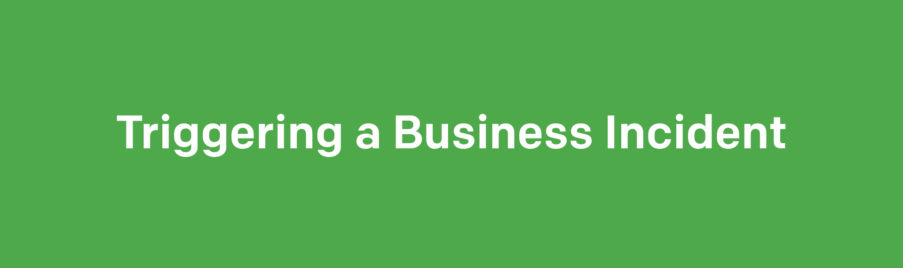

---
cover:
description: The precise mechanics for how to trigger a business incident from a severe technical incident
---

When an ongoing incident is escalated to severe technical incident status, a new business incident is triggered. Business incident response operates as a subgroup of the technical incident. Therefore, two key roles must shift into the subgroup and away from the technical incident group.

The Technical SLT, formerly in the role of a business SME on the technical call, must then leave the technical incident call and join the new business incident call. Additionally, a technical subject matter expert is needed on the new business incident call to ensure technical accuracy and brief the subgroup on the details of the technical incident.

The Customer Liaison on the technical incident call should page a backup responder that can fill their role. Once the backup Customer Liaison is present on the technical call, the primary liaison should handoff their responsibilities to the backup. The formerly-primary liaison will then leave the technical incident call to join the new business incident call. This handoff is designed to ensure the least possible time for both groups to have someone in each role that is up to speed on the current situation.

Once a [Business Lead](roles.md#business-lead) is also on the business incident call, resolution of the new business incident can begin.
